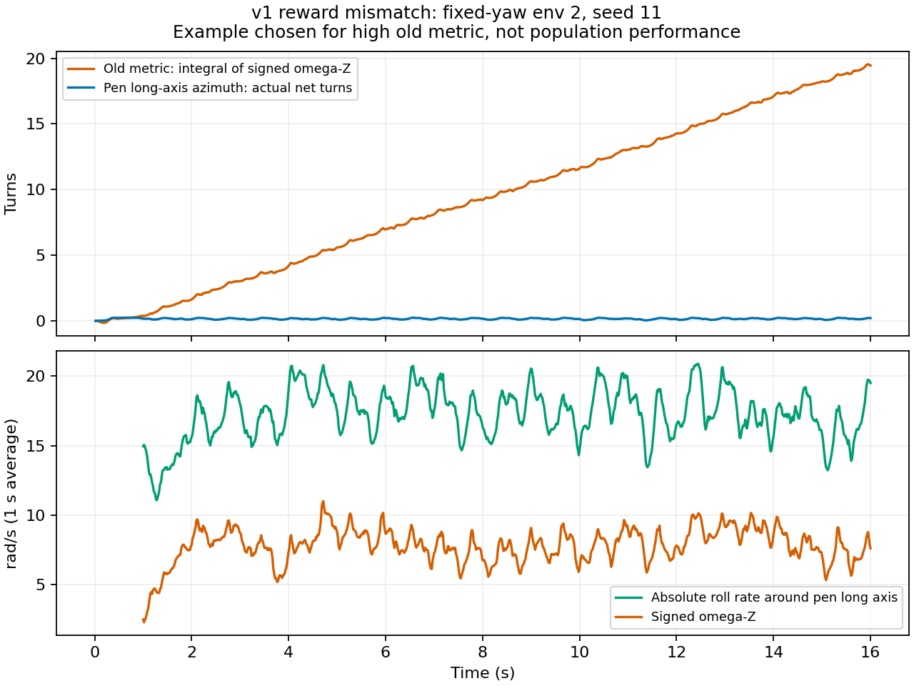

# DH116 转笔：基线纠正与无外部 LLM 的训练闭环

日期：2026-09-07。当前阶段是 DH116 / Isaac Lab 上的转笔行为复现，
尚未完成 Eureka 的 LLM 奖励搜索或论文式姿态课程。手部视觉材质保持原样；
策略使用 41 维状态观测，未使用图像。

后续更新：本报告基线及配对训练使用的是关闭自碰撞的历史物理配置。
9 月 8 日完成了[自碰撞修复与有限场景验证](dh116_self_collision_2026-09-08.md)，
现在训练、展示默认启用修复配置。下列历史成绩不能当作新物理下的成绩。

## v1 原指标的问题

v1 的奖励与“圈数”来自 `spin_sign * pen_angvel[:, 2]`。笔相对掌面倾斜时，
沿笔自身长轴的滚动也会产生世界 Z 方向角速度，不能将其积分直接解释为绕掌面转笔。

对 `2026-09-06_02-13-16_v1/model_2999.pt` 的姿态轨迹检查显示，多个环境主要
沿自身长轴滚动约 12–15 rad/s，长轴方向几乎不绕掌面转圈。下面的固定环境 2
在 16 秒内，旧指标累计 19.45 圈，实际长轴方位净转角约 0.21 圈。
这个例子按旧指标较高选出，仅用于解释指标失真，不代表总体性能。

另一个问题是自动 reset：`DirectRLEnv.step()` 先计算终止，再重置环境，
最后返回观测。旧回放脚本读取重置后的 `on_palm`，可能漏记掉笔。
新实现从 reward 回调中保存 reset 前的状态，整次试验只给第一次掉笔前的运动计分。
主动在第一步移走一支笔的集成检查已确认：掉笔时间是 1/60 秒，后续新笔不会累计圈数。

## 固定基线协议与结果

- checkpoint：`logs/rsl_rl/dh116_pen_spin/2026-09-06_02-13-16_v1/model_2999.pt`
- 每个随机种子 256 环境，初始 yaw 为 16 个等间隔分组，每组 16 次。
- 随机种子 11 和 29；位置和关节重置噪声继承训练配置。
- 每个环境观察 32 秒，episode timeout 延至 33 秒，仅评估第一次掉笔之前。
- 掉笔定义沿用原来的位置包络，不声称验证了手笔接触。
- 启动：连续 1 秒窗口内平均有向投影转速至少 3 rad/s。
- 成功：5 秒内启动、全程不掉笔、首秒后平均投影转速至少 3 rad/s。
- 长轴 XY 投影长度小于等于 0.2 时，方向不可靠，不给转速分。
- 这些是本项目的预先固定评估条件，不是 Eureka 论文的原始评分标准。

| 指标 | seed 11 | seed 29 |
| --- | ---: | ---: |
| 有向 omega-Z 转速中位数（旧物理量） | 6.39 rad/s | 6.64 rad/s |
| 实际长轴投影转速均值 | -0.0013 rad/s | 0.0022 rad/s |
| 实际长轴净圈数中位数 | 0.096 | 0.106 |
| 掉笔 | 58/256 | 52/256 |
| 掉笔时间中位数（掉笔样本） | 9.45 s | 13.87 s |
| 成功 | 0/256 | 0/256 |

历史“32 环境、16 秒、零掉笔、一圈/秒”记录的测量存在缺陷。
新试验更长、起始状态不同，不能把两个批次的掉笔率直接作配对比较。

原始报告：`logs/evaluations/dh116_v1/seed11.json`、`seed29.json`。
轨迹检查：同目录的 `axis_check.json` / `axis_check.npz`。
修改前源码和 SHA-256：`logs/baselines/dh116_v1_source_2026-09-07/`。

## 已实现的训练与评估接口

1. `eval_pen_spin.py` 恢复 checkpoint 随附的环境/PPO 配置，固定随机种子和 yaw 分组，
   输出逐环境、逐朝向以及总体指标。可用 `--save_trajectory` 导出原始轨迹。
2. `play_pen_spin.py` 使用实际长轴投影转角，默认录制指定的 env 0；
   可用 `--record_env` 明确选择，不再自动挑“最好”的录像。
3. `train_pen_spin.py` 支持恢复配置、选择奖励模式、独立输出目录，并记录源码快照、
   配置和最终 checkpoint 路径。
4. `run_reward_experiments.py` 不调用外部 LLM/API。它把明确写好的两种奖励依次送入
   训练、保存、固定评估、分项曲线提取和结果比较；每张 GPU 同时只分配一个候选任务。

v2 主奖励使用笔长轴 `a` 的逐步实际方位变化：

`signed_rate = spin_sign * atan2(cross(a_prev_xy, a_xy), dot(a_prev_xy, a_xy)) / dt`

笔沿自身轴滚动不会改变 `a`，因此拿不到这项奖励。
正反向转速使用对称的 `[-10, 10] rad/s` 截断，避免 v1 的非对称截断给
等幅正反摆动净奖励。角度采样假设每个控制步的转角小于 π。
倾角惩罚接口已保留，本次配对试验中系数为零，先隔离主奖励的改变。

9 项离线检查覆盖已知圈数、reset 后禁止累计、晚掉笔、竖直退化、方向符号、
沿自身轴滚动、±π 边界及摆动抵消。两候选 × 2 次 PPO 迭代的小规模集成试验
已完成训练、checkpoint 加载和两个种子的评估；它仅验证链路，不表示学会技能。

## 300 次新增迭代的配对试验

配对短训练使用同一个 v1 checkpoint，各 300 次新增 PPO 迭代、4096 环境、
16 秒 episode、相同训练 seed 和 entropy。一组保留 omega-Z 奖励，一组使用
实际转角奖励。最终报告位于：
`logs/reward_experiments/dh116_heading_pilot_2026-09-07/summary.json`。

两组训练及全部评估已完成。以下是每组两个评估 seed、合计 512 次试验的结果：

| 指标 | 旧奖励对照 | 实际转角奖励 v2 |
| --- | ---: | ---: |
| 成功 | 0/512 | 0/512 |
| 掉笔 | 109/512（21.29%） | 128/512（25.00%） |
| 实际长轴投影转速均值 | -0.00027 rad/s | 0.00802 rad/s |
| 笔轴倾角均值 | 23.94° | 12.16° |

v2 基本停止了沿自身长轴的滚动，但没有学会持续绕掌面转动。
笔变平也不是本次单独训练出的倾角奖励效果：本次没有启用倾角惩罚。
两组均未达到成功条件，因此没有晋升任何候选为成功策略。
结果仅说明短时间 warm-start 微调的行为变化，不能据此断言这个新目标不可学。
两个候选的最终 checkpoint 都是各自训练目录下的 `model_3298.pt`。

回放兼容性也已验证：固定 env 0 的 2 秒录制输出 60 帧，1920×1080，
位于 `renders/dh116_v1_corrected_metric_check.mp4`，显示修正后的投影转速与圈数。

## 后续工作

即使流程完整跑通，只要固定成功指标为零，就不能宣布复现完成。
后续应增加 DH116 可达范围内的目标姿态重定向任务，再尝试连续旋转目标的课程。
这样也能逐步替换 v1 以沿笔轴滚动为主的行为。完整研究比较需要多个训练 seed；
本次两个评估 seed 不能替代多个独立训练 seed。
